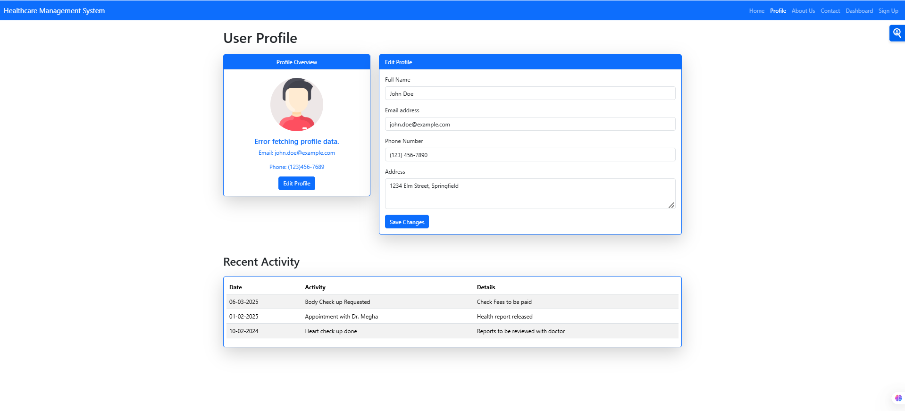

## 🏥 Healthcare Management System
 
## 🚀 Live Demo  
[Click Here](https://hms-5i3f.onrender.com/)  

## 📂 GitHub Repository  
[Click Here](https://github.com/dkm3689/Your-Health-Manager)  

## 🛠 Tech Stack  
- Node.js  
- Express.js  
- MongoDB (Mongoose)  
- Bootstrap  
- JWT  

## 📌 Features  
✔️ **User Authentication** - JWT-based authentication for secure access  
✔️ **Appointment Booking** - Users can schedule and manage appointments  
✔️ **Profile Management** - Update and view personal details  
✔️ **Dashboard** - Overview of upcoming appointments and user details  
✔️ **Secure Password Handling** - Bcrypt password hashing  

## 📸 Screenshots  
 
 
  

## 📖 API Endpoints

- **POST** `/signup` → Register a new user  
- **POST** `/login` → Authenticate user and start session  
- **GET** `/dashboard` → Access user dashboard (requires authentication)  
- **GET** `/profile` → Retrieve user profile details (requires authentication)  

## 🛠 Installation & Setup  
```bash
git clone https://github.com/your-username/healthcare-management-system.git
cd healthcare-management-system
npm install
npm start
